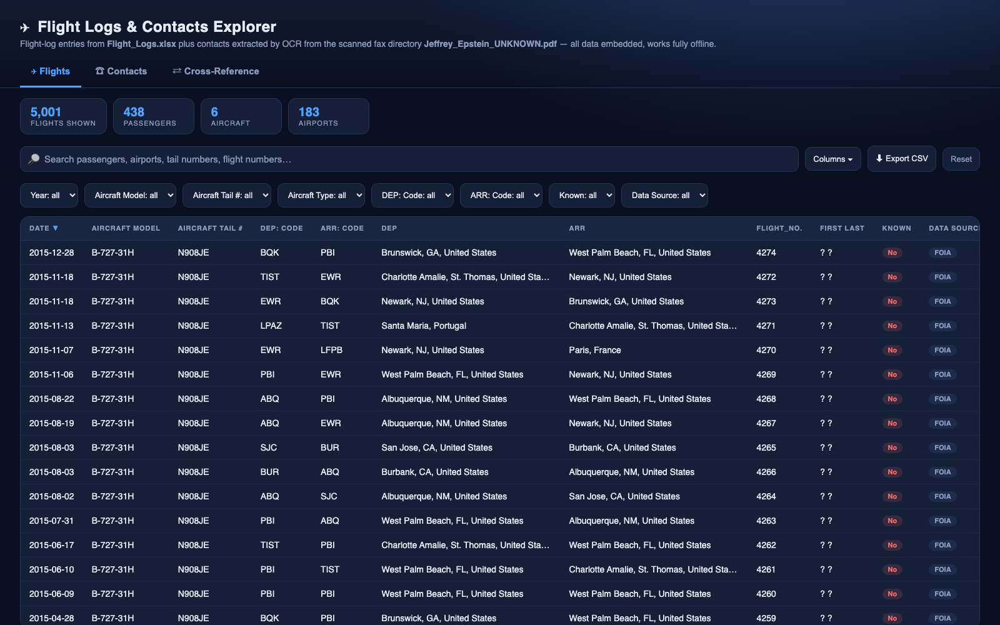
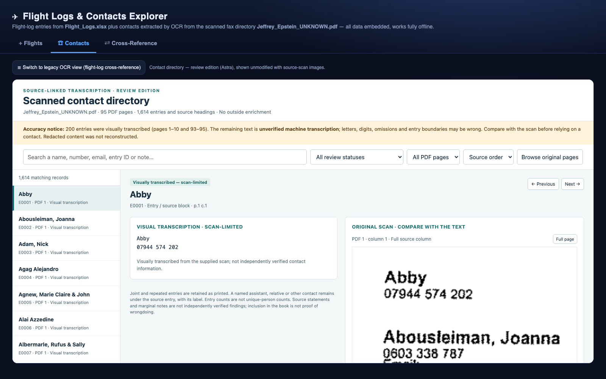
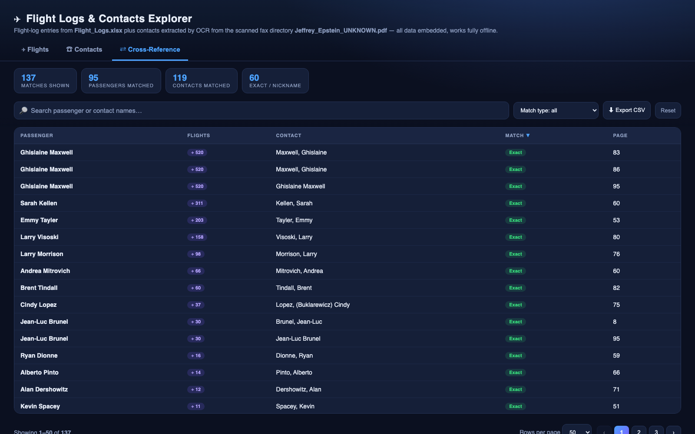

# ✈ Flight Logs & Contacts Explorer

**An offline, self-contained HTML explorer for the released Jeffrey Epstein flight logs
(5,001 entries) and the scanned 95-page contact directory fax — searchable flights,
source-linked contacts, and a fuzzy cross-reference between passengers and contacts.**

No server, no dependencies, no internet required: open one HTML file and explore.



---

## What's inside

### ✈ Flights tab
Every flight-log entry from `Flight_Logs.xlsx` (1995–2015), fully client-side:

- Instant global search (passengers, airports, tail numbers, flight numbers) with highlighting
- Facet filters: year, aircraft model, tail number, aircraft type, departure/arrival, known, data source
- Live stats (flights, passengers, aircraft, airports), sortable columns, column picker
- Row detail modal, pagination, CSV export of the current filter

### ☎ Contacts tab
The scanned fax contact directory (`Jeffrey_Epstein_UNKNOWN.pdf`), shown through the
**review edition** (`Contact_directory_review.html`) with 1,614 entries and a
**side-by-side scan-image comparison** for every record — nothing restyled or altered.

- Toggle button switches to the **legacy OCR view**: 1,328 contacts extracted with a
  custom computer-vision + tesseract pipeline (column detection, block reconstruction,
  handwritten pages transcribed manually)



### ⇄ Cross-Reference tab
Fuzzy matching between **295 flight-log passengers** and **1,614 directory entries** —
**137 matches across 95 passengers and 119 contacts**, in four confidence tiers:

| Tier | Meaning |
|---|---|
| **Exact** | Full first + last name match (either order) |
| **Nickname** | Same last name, related first names (Bill↔William, Mandy↔Amanda, ~90 diminutive groups + prefix matching) |
| **Initial** | Same last name, same first initial (abbreviated entries) |
| **Weak** | Single-name handwritten entries matched on rare first names — educated guesses, clearly labeled |

- Filter by match type, search, sort, CSV export
- Modal detail per match, with one-click jump to the passenger's flights



---

## How to use

1. Clone or download this repository.
2. Open **`flight_logs_explorer.html`** in any modern browser.
3. Keep `Contact_directory_review.html` in the same folder — the Contacts tab loads it
   in an embedded frame. Everything else is embedded in the main file.

That's it. Deep links supported: `#flights`, `#contacts`, `#xref`.

## Exports

Pre-built datasets, ready for your own analysis:

| File | Contents |
|---|---|
| `flights.json` | 5,001 flight-log rows, dates normalized to ISO |
| `contacts.json` / `contacts.csv` | 1,328 OCR-extracted contacts + flight-log cross-ref |
| `astra_contacts.json` | 1,614 directory entries from the review-edition workbook |
| `xref.json` | 137 passenger ↔ contact matches with confidence tiers |

Every view in the explorer also has an **Export CSV** button that downloads exactly
what you have filtered on screen.

## How to rebuild from source

The whole pipeline is local and dependency-light (Python 3 stdlib + `pymupdf`,
`pillow`, and `tesseract` for OCR):

```bash
python3 extract.py            # Flight_Logs.xlsx            -> flights.json
python3 extract_astra.py      # Contact_directory_review.xlsx -> astra_contacts.json
python3 preprocess_cols.py    # render PDF, detect text regions & columns -> cols/
# tesseract each cols/*.png   -> ocr/*.tsv
python3 parse_contacts.py     # OCR TSV + manual_contacts.json -> contacts.json/.csv
python3 build_xref.py         # passengers x contacts fuzzy match -> xref.json
python3 build.py              # embed everything -> flight_logs_explorer.html
```

Handwritten PDF pages 93–95 can't be OCR'd — their transcriptions live in
`manual_contacts.json`; edit it and rerun the last two steps to fix anything.

## Data sources & accuracy

- `Flight_Logs.xlsx` — flight logs as released in court filings / FOIA.
- `Jeffrey_Epstein_UNKNOWN.pdf` — scanned fax contact directory ("the black book"),
  a public court-released document. It is a degraded fax: OCR may contain digit-level
  errors, and the review edition marks machine-read vs visually transcribed records.
  **The scan is authoritative** — compare against the source images before relying on
  any entry.
- Presence in these documents is **not evidence of wrongdoing**; they are published
  records reproduced here for research and journalism.

## Repository layout

```
flight_logs_explorer.html      ← the app (open this)
Contact_directory_review.html  ← review edition, embedded in the Contacts tab
Contact_directory_review.xlsx / .txt
Flight_Logs.xlsx, Jeffrey_Epstein_UNKNOWN.pdf   ← source documents
extract.py, extract_astra.py, preprocess_cols.py,
parse_contacts.py, build_xref.py, build.py      ← pipeline
flights.json, contacts.json/.csv, astra_contacts.json,
xref.json, manual_contacts.json                 ← datasets
screenshots/                                    ← images used above
```
